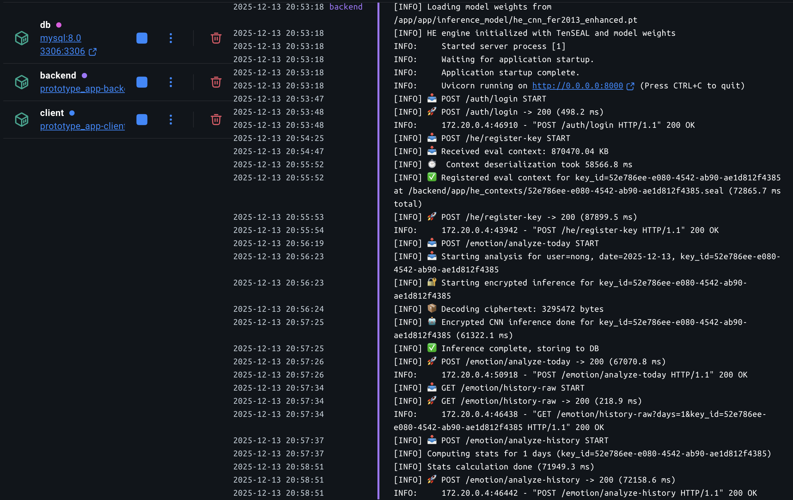

# FHE Emotion - 동형암호 기반 프라이버시 보존형 감정 분석 서비스

**서버가 데이터를 전혀 볼 수 없는 상태에서 AI 추론을 수행하는 프라이버시 보존형 감정 분석 시스템**

> 본 프로젝트는 CKKS 스킴 기반 동형암호(FHE)를 활용하여, 사용자의 얼굴 이미지를 암호화된 상태로 서버에서 CNN 추론을 수행하고, 장기 감정 패턴 분석을 통해 정신 건강 상태를 진단하는 프로토타입입니다.

---

## 핵심 특징

| 특징 | 설명 |
|------|------|
| **Zero Privacy Leakage** | 이미지가 클라이언트에서 암호화되어 서버로 전송, 서버는 원본 열람 불가 |
| **Encrypted Inference** | TenSEAL 라이브러리로 암호화된 상태 그대로 CNN 연산 수행 |
| **Owner-Only Decryption** | 비밀키를 가진 사용자만 결과 복호화 가능 |
| **Encrypted Statistics** | 복호화 없이 N일간 감정 합계/변동성 계산 |

---

## Docker로 실행하기

### 사전 준비
- [Docker Desktop](https://www.docker.com/products/docker-desktop/) 설치
- **Docker Desktop 메모리 8GB 이상 설정** (필수)
  - Settings → Resources → Memory → **8GB 이상** (10GB 권장)
  - CKKS eval context가 약 850MB이며, 역직렬화 시 추가 메모리 필요
  - 메모리 부족 시 Backend 컨테이너가 OOM Killed (Exit 137) 됨

### 1. 빌드 및 실행

```bash
# 프로젝트 디렉토리로 이동
cd prototype_app

# 빌드 및 실행 (백그라운드)
docker compose up --build -d

# 로그 확인
docker compose logs -f
```

정상 실행 시 아래와 같은 로그가 출력됩니다:



### 2. 접속

| 서비스 | URL | 설명 |
|--------|-----|------|
| **Streamlit Client** | http://localhost:8501 | 사용자 인터페이스 |
| **FastAPI Backend** | http://localhost:8000/docs | API 문서 (Swagger) |
| **MySQL DB** | localhost:3306 | 데이터베이스 |

### 3. 종료

```bash
docker compose down
```

---

## 사용 가이드

### Step 1: 회원가입 및 로그인

1. http://localhost:8501 접속
2. **Register** 섹션 → ID/비밀번호 입력하여 회원가입
3. **Login** 섹션 → 로그인

### Step 2: FHE 키 생성 및 등록

1. 로그인 후 자동으로 **CKKS 키 쌍 생성** (최초 1회, 약 30초~1분 소요)
   - 비밀키: 클라이언트 로컬 (`keys/` 폴더)에만 저장
   - 연산용 공개키: 서버에 등록
2. Key setup에서 Ensure local keypair & register eval context으로 키 등록. `Active key_id: xxxx-xxxx-xxxx` 표시. 40초 정도 소요됨.

### Step 3: 오늘의 감정 분석

1. **Today** 탭 선택
2. 얼굴 이미지 업로드 (jpg, png)
3. **Encrypt and Analyze today** 버튼 클릭
4. ⏳ **약 40초 대기** (암호화 추론 수행)
5. 감정 분류 결과 및 확률 분포 확인

### Step 4: N일 히스토리 조회 및 분석

1. **History** 탭 선택
2. 조회할 일수(N) 입력
3. **Fetch History** 버튼 클릭
4. 서버에 저장된 암호화된 감정 데이터 조회 → 클라이언트에서 복호화하여 표시
5. **Analyze** 버튼 클릭
6. 서버에서 암호화된 상태로 통계 계산 후 반환
7. 클라이언트에서 복호화하여 진단 결과 표시:
   - **우울증 위험**: 슬픔 감정 지속 여부
   - **양극성 장애 위험**: 감정 변동성 분석

---

## 프로젝트 구조

```
prototype_app/
├── docker-compose.yml       # Docker 서비스 정의
├── .dockerignore            # Docker 빌드 제외 파일
│
├── backend/                 # FastAPI 백엔드 서버
│   ├── Dockerfile
│   ├── requirements.txt
│   └── app/
│       ├── main.py                 # FastAPI 진입점
│       ├── api/                    # REST API 라우터
│       │   ├── routes_auth.py      # 인증 (회원가입/로그인)
│       │   ├── routes_emotion.py   # 감정 분석 API
│       │   └── routes_he.py        # FHE 키 등록 API
│       ├── fhe_core/               # ✅ 동형암호 핵심 로직
│       │   ├── fhe_cnn.py          # FHE 친화적 CNN 모델
│       │   ├── fhe_inference.py    # 암호화 추론 (im2col + conv2d)
│       │   └── tenseal_context.py  # CKKS 파라미터 설정
│       ├── services/
│       │   ├── he_service.py       # FHE 엔진 (추론/통계)
│       │   ├── emotion_service.py  # 감정 분석 서비스
│       │   └── analysis_service.py # N일 분석 서비스
│       ├── inference_model/        # 학습된 모델 가중치 (.pt)
│       ├── he_contexts/            # 서버 Eval 컨텍스트 저장
│       └── ...
│
└── client/                  # Streamlit 클라이언트
    ├── Dockerfile
    ├── requirements.txt
    └── streamlit_app/
        ├── app.py                  # 메인 UI
        ├── fhe_keys.py             # ✅ 키 생성/관리
        ├── preprocessing.py        # 이미지 전처리 (CLAHE 필터)
        ├── diagnostics.py          # 정신건강 진단 로직
        ├── api_client.py           # 백엔드 API 호출
        └── keys/                   # 로컬 키 저장소 (비밀키 포함)
```

---

## 보안 아키텍처

```
┌─────────────────────────────────────────────────────────────────┐
│                         CLIENT (Trust Zone)                      │
│  • 비밀키 생성 및 로컬 저장                                        │
│  • 이미지 암호화 (CKKS)                                           │
│  • 결과 복호화 및 진단                                             │
└──────────────────────────────┬──────────────────────────────────┘
                               │ 암호화된 데이터 + 연산용 공개키
                               ▼
┌─────────────────────────────────────────────────────────────────┐
│                       SERVER (Untrusted Zone)                    │
│  • ❌ 비밀키 없음 → 원본 데이터 열람 불가                          │
│  • ✅ 연산용 공개키로 암호화 상태에서 CNN 추론                      │
│  • ✅ 암호화된 통계 계산 (합산, 변동성)                             │
└─────────────────────────────────────────────────────────────────┘
```

---

## FHE 친화적 CNN 모델

동형암호 환경의 제약(곱셈 깊이 제한, 비선형 연산 불가)을 극복하기 위해 설계된 모델:

| 레이어 | 구성 | 비고 |
|--------|------|------|
| **Conv1** | 1→16ch, Kernel 9×9, Stride 6 | im2col 기반 병렬 연산 |
| **Activation** | Square (x²) | ReLU 대신 다항식 근사 |
| **FC1** | 784 → 128 | Flatten 후 완전연결 |
| **Activation** | Square (x²) | |
| **FC2** | 128 → 7 | 7가지 감정 클래스 |

**CKKS 파라미터**:
- Poly Modulus Degree: 32,768 (128-bit 보안)
- 슬롯 수: 16,384
- 스케일: 2^40

---

## 성능

| 항목 | 수치 |
|------|------|
| **추론 속도** | 18~20초/이미지 |
| **정확도** | 55~60% (FER-2013 기준) |
| **Docker 이미지 크기** | Backend 1.47GB, Client 3.19GB |

---

## 기술 스택

- **FHE**: TenSEAL (CKKS Scheme)
- **Deep Learning**: PyTorch
- **Backend**: FastAPI, SQLAlchemy, MySQL
- **Frontend**: Streamlit
- **Image Processing**: OpenCV, Pillow
- **Container**: Docker, Docker Compose

---

## 참고 자료

- [TenSEAL GitHub](https://github.com/OpenMined/TenSEAL)
- [FER-2013 Dataset (Kaggle)](https://www.kaggle.com/datasets/msambare/fer2013)
- [CKKS Paper (ASIACRYPT 2017)](https://eprint.iacr.org/2016/421)

---

## 개발
- 중앙대 소프트웨어학과 19학번
- 김현욱, 정훈석